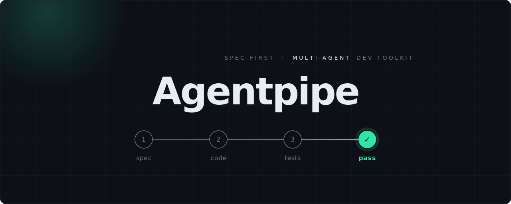

<p align="center">
  
</p>

<h1 align="center">Agentpipe</h1>

<p align="center">
  A lightweight, spec-first development toolkit for agentic AI coding agents.
</p>

It enforces the cycle **spec (with acceptance scenarios) → code + tests → build pass** through skills, always-on guardrails, and a universal test runner.

**Agents:** [Claude Code](https://claude.ai/code) (full hook enforcement) plus Codex, Cursor, Antigravity, OpenClaw, and Hermes (skills + advisory guard rules). Install for one or all: `agentpipe init --agents <list>|all`. See [docs/multi-agent.md](docs/multi-agent.md).
**Works with:** Swift, TypeScript/JavaScript, Python, Rust, Go, Java/Kotlin, C#, Ruby.
**Dependencies:** None (requires only a supported agent CLI, Node.js, Git, and Bash).
**Optional:** [GraphAtlas](https://github.com/microvn/graphatlas) MCP server for graph-based code intelligence — six skills use it automatically when present and fall back to `grep` when it isn't. See [§3 Setup](#3-setup).

---

## Table of Contents

1. [Philosophy](#1-philosophy)
2. [Quick Start](#2-quick-start)
3. [Setup](#3-setup)
4. [Daily Workflows](#4-daily-workflows)
5. [Commands Reference](#5-commands-reference)
6. [Automatic Guards (Hooks)](#6-automatic-guards-hooks)
7. [Spec Format](#7-spec-format)
8. [Customization](#8-customization)
9. [Token Cost Guide](#9-token-cost-guide)
10. [Troubleshooting](#10-troubleshooting)
11. [FAQ](#11-faq)

---

## 1. Philosophy

### The Core Cycle

```
SPEC (with acceptance scenarios) → CODE + TESTS → BUILD PASS
```

Every code change — feature, fix, or removal — follows this cycle. The spec is the source of truth. Acceptance scenarios (Given/When/Then) are embedded directly in the spec — no separate test plan file. If code contradicts the spec, the code is wrong.

### Why Spec-First?

- **Prevents drift.** Acceptance scenarios live inside the spec — no separate test plan to fall out of sync.
- **Tests have purpose.** Scenarios derived from specs test behavior, not implementation details. This means tests survive refactoring.
- **AI writes better code.** When an agent has a spec with concrete Given/When/Then scenarios, it generates more accurate implementations and more meaningful tests.
- **Reviews are grounded.** Reviewers can check code against the spec rather than guessing at intent.

### Principles

1. **Specs are source of truth** — Code changes require spec updates first.
2. **Incremental, not big-bang** — Test after each code chunk, not after everything is done.
3. **Tests travel with code** — Every PR includes production code + tests + spec updates.
4. **Build pass is the gate** — Nothing merges with failing tests.
5. **Everything in the repo** — Specs, plans, tests, and code are version-controlled and reviewable.

---

## 2. Quick Start

**Time needed: 5 minutes.** Below is a realistic transcript — user input, what each skill actually asks, what it actually outputs. Nothing embellished.

```bash
npx agentpipe init .              # install for Claude Code (default)
# or target other agents:
npx agentpipe init . --agents cursor,codex
npx agentpipe init . --agents all

claude                            # open your agent (claude, codex, cursor, …)
```

> The transcript below is on Claude Code. The same skills install for Codex, Cursor,
> Antigravity, OpenClaw, and Hermes — see [§ Supported agents](#supported-agents).

### Step 1 — Spec the feature (`/ap-plan`)

```text
You: /ap-plan "add tag filter to the todo list screen"

Claude → running /ap-plan
  Phase 0: Codebase scan — found docs/specs/todo-list/todo-list.md (exists)
  Phase 1: Scope Challenge — TodoList already supports text search; tag
           filter can reuse the same query pipeline. Flagging: reuse vs rebuild.

AskUserQuestion: "Extend existing search, or add a separate tag filter UI?"
  A) Extend search       — one input, parsed (text + "tag:work")   [lowest cost]
  B) Separate tag chips  — chips below the search box              [clearer UX]
  C) Both                 — chips drive the same query             [most work]

You: B

Claude: Drafting spec…
  docs/specs/todo-list/todo-list.md  (Mode C update, snapshot created)

  ## Stories (added)
  ### S-007: Filter todos by tag (P0)
    AS-014: Given todos tagged [work, home], when user taps "work" chip,
            then only work-tagged todos show.
    AS-015: Given no todos match the selected tags, when filter applied,
            then empty state shows "No todos match these tags".

  What Already Exists: TodoRepository.query() handles predicates — reuse.
  Not in Scope: saving favorite tag combinations (deferred).
```

> **Complex spec?** Run `/ap-challenge docs/specs/<feature>/<feature>.md` before coding.
> It spawns parallel hostile reviewers (Security Adversary, Failure Mode Analyst,
> Assumption Destroyer, Scope & YAGNI Critic) that quote the spec and propose surgical
> edits — e.g. "AS-014 doesn't define tag case-sensitivity → add constraint or AS".
> Skip for simple CRUD like this tag filter.

### Step 2 — Implement + build (`/ap-build`)

```text
You: (edit TodoListView.swift, TagFilterChip.swift) — now /ap-build

Claude → running /ap-build
  Phase 1.5: Coverage Map
    [+] TodoListView.swift
        └── applyTagFilter(selected:)
            ├── [★★  TESTED] empty selection → returns all   (new test)
            ├── [★★  TESTED] single tag match                 (new test)
            ├── [GAP]         no-match empty state            (← AS-015)
            └── [★★  TESTED] multi-tag AND semantics          (new test)

  Writing test for [GAP]… building… running.
  ✓ 14 tests passed (3 new, 0 regressions)
```

### Step 3 — Bug found? (`/ap-fix`)

```text
You: /ap-fix "selecting two tags shows OR results, should be AND"

Claude → running /ap-fix
  Phase 0: Bug Path Diagram
    applyTagFilter(selected: ["work","urgent"])
      └── [BUG] predicate uses .contains(anyOf:) — should be .contains(allOf:)

  Phase 1: writing failing test (AS-014 variant: 2 tags, AND)… FAILS ✓
  Phase 2: changing .anyOf → .allOf in TodoRepository.swift:88 (1 line)
  Phase 3: test now PASSES, full suite green.

  DEBUG REPORT
    Root cause: wrong set operator, regression from S-005 search refactor
    Prevention: add AS for multi-tag AND to spec (auto-signaled)
```

### Step 4 — Review + commit (`/ap-review` → `/ap-commit`)

```text
You: /ap-review

Claude → Smart Focus: UI state + query predicate
  Failure Mode Grid: all paths have tests ✓ error states covered ✓
  Finding (confidence 8/10): selected-tags state not persisted across
    navigation. Not in current spec — logged under "Not in Scope".
  Verdict: APPROVE

You: /ap-commit

Claude → secret scan: clean. debug-code scan: clean.
  Staging 4 files. Conventional message:
    feat(todo): filter list by selected tags with AND semantics
  ✓ commit a1b2c3d (not pushed — run `git push` when ready)
```

> **Complex bug?** Insert `/ap-investigate "<bug>"` before `/ap-fix`. It's read-only,
> writes `docs/investigate/<slug>-<date>.md` with hypotheses + blast radius, then
> `/ap-fix` auto-picks it up. Skip for trivial bugs.

That's the 5 minutes. The CLI auto-detected your project (Swift + XCTest here) — no config touched.

---

## 3. Setup

### Prerequisites

| Tool | Required | Why |
|------|----------|-----|
| **A supported agent CLI** | Yes | Runs the skills — Claude Code, Codex, Cursor, Antigravity, OpenClaw, or Hermes |
| **Git** | Yes | Change detection, commit workflow |
| **Node.js** (18+) | Yes | File guard hook, JSON parsing |
| **Bash** (4+) | Yes | Path guard hook, shell-based hooks |
| **Language toolchain** | Yes | Whatever your project uses (Swift, npm, pytest, etc.) |
| **[GraphAtlas](https://github.com/microvn/graphatlas)** | Optional | Graph-based code intelligence — skills prefer it over `grep` when connected (see below) |

### Installation

**Option A: One-command install** (recommended)

```bash
npx agentpipe init .
```

**Option B: Global install**

```bash
npm install -g agentpipe

# Then, in any project:
cd my-project
agentpipe init .
```

**Option C: Global skills install** (available in all projects without running `init` again)

```bash
agentpipe init --global
# or after per-project init, answer "yes" to the global prompt
```

Skills installed globally at `~/.claude/skills/` are available in every project. Per-project `.claude/skills/` always takes precedence over global — so projects can still override individual skills.

**Option D: Force re-install** (overwrites existing files)

```bash
npx agentpipe init --force .
```

**Option D: Selective install** (only specific components)

```bash
npx agentpipe init --only hooks,skills .
```

**Option E: Multi-agent install** (one agent, several, or all)

```bash
npx agentpipe init --agents cursor .            # one
npx agentpipe init --agents claude,codex .      # several
npx agentpipe init --agents all .               # every supported agent
```

### Supported agents

The skills are authored once and emitted into each agent's native format on install.
The markdown body is identical across agents; only the file location, name, and
frontmatter change. Only Claude Code has a native hook system — every other agent
gets the same guardrails as **always-on advisory rules** instead of enforced hooks.

| Agent | Install location | Guardrails |
|-------|------------------|-----------|
| **Claude Code** | `.claude/skills/ap-*/SKILL.md` + `.claude/hooks/` | Hook-enforced |
| **Antigravity** | `.agents/skills/ap-*/SKILL.md` | `.agents/rules/` (advisory) |
| **OpenClaw** | `skills/ap-*/SKILL.md` | `AGENTPIPE-GUARDS.md` (advisory) |
| **Hermes** | `optional-skills/agentpipe/ap-*/SKILL.md` | `AGENTPIPE-GUARDS.md` (advisory) |
| **Codex CLI** | `.codex/skills/ap-*/SKILL.md` | `AGENTS.md` section (advisory) |
| **Cursor** | `.cursor/rules/ap-*.mdc` | `.cursor/rules/` (advisory) |

Skills that use Claude-only tools (`AskUserQuestion`, subagents) get a "Running outside
Claude Code" note appended for the other agents, so they degrade gracefully. The specs
and workflow themselves are tool-agnostic. Full details: [docs/multi-agent.md](docs/multi-agent.md).

### What Gets Installed

The tree below is the **Claude Code** layout (`--agents claude`, the default). Other
agents install the same skills into their own locations — see [Supported agents](#supported-agents).

```
your-project/
├── .agentpipe/
│   └── manifest.json          ← install manifest (tracks files per agent; used by upgrade/remove)
├── .claude/
│   ├── CLAUDE.md              ← Project rules hub
│   ├── settings.json          ← Hook wiring
│   ├── hooks/
│   │   ├── file-guard.js      ← Warns on large files
│   │   ├── path-guard.sh      ← Blocks wasteful Bash paths
│   │   ├── glob-guard.js      ← Blocks broad glob patterns
│   │   ├── comment-guard.js   ← Blocks placeholder comments
│   │   ├── sensitive-guard.sh ← Blocks access to secrets
│   │   └── self-review.sh     ← Quality checklist on stop
│   └── skills/
│       ├── ap-explore/SKILL.md      ← /ap-explore skill
│       ├── ap-scaffold/             ← /ap-scaffold skill (greenfield bootstrap)
│       │   ├── SKILL.md
│       │   └── references/          ← ARCHITECTURE/DESIGN templates, ADR template,
│       │       │                       stack-profiles/ seeds (copy to ~/.claude or
│       │       │                       ./.claude to customize — bundled copy is overwritten on upgrade)
│       │       ├── ARCHITECTURE.md.tmpl
│       │       ├── DESIGN.md.tmpl
│       │       ├── adr/NNNN-template.md
│       │       └── stack-profiles/react.md
│       ├── ap-plan/SKILL.md         ← /ap-plan skill
│       ├── ap-challenge/SKILL.md    ← /ap-challenge skill
│       ├── ap-build/SKILL.md        ← /ap-build skill
│       ├── ap-investigate/SKILL.md  ← /ap-investigate skill (optional, read-only)
│       ├── ap-fix/SKILL.md          ← /ap-fix skill
│       ├── ap-review/SKILL.md       ← /ap-review skill
│       ├── ap-commit/SKILL.md       ← /ap-commit skill
│       ├── ap-spec-render/          ← /ap-spec-render skill (spec HTML view, user-invoked)
│       │   ├── SKILL.md
│       │   ├── template.html
│       │   ├── components.md
│       │   └── examples/
│       ├── ap-md-render/            ← /ap-md-render skill (generic markdown HTML view)
│       │   ├── SKILL.md
│       │   ├── template.html
│       │   └── components.md
│       ├── ap-voices/SKILL.md       ← /ap-voices skill (multi-LLM review)
│       └── ap-humanize/SKILL.md     ← /ap-humanize skill (rephrase to human voice)
└── docs/
    ├── specs/                 ← Your specs (folder-per-feature)
    │   └── <feature>/
    │       ├── <feature>.md   ← Spec with acceptance scenarios
    │       └── snapshots/     ← Version history (managed by /ap-plan)
    └── WORKFLOW.md            ← Process reference
```

### Optional: GraphAtlas Code Intelligence

The `ap-*` skills work out of the box with `grep`. But when [GraphAtlas](https://github.com/microvn/graphatlas) (GA) is connected as an MCP server, six skills — `/ap-explore`, `/ap-plan`, `/ap-build`, `/ap-fix`, `/ap-review`, `/ap-investigate` — prefer it over `grep` for code discovery, call-graph tracing, and blast-radius analysis.

**Why it helps:** `grep` can't tell a call site from a string literal, doesn't see polymorphic dispatch, and won't follow re-exports. An agent that edits one function but misses its callers, test files, and overrides in other modules ships a bug. GA indexes the repo once into a local graph with typed `CALL` / `IMPORT` / `OVERRIDE` edges, then answers structural questions deterministically in milliseconds with a small token footprint. It runs 100% locally — no LLM, no embeddings, no telemetry.

**How the skills use it:** each skill runs a one-time probe (`ga_architecture`) at the start. If GA responds, it leans on tools like `ga_impact` (blast radius + affected tests), `ga_callers` / `ga_callees` (call graph), `ga_symbols` (definition lookup), and `ga_rename_safety`. If GA is absent — or the index is stale — the skill falls back to `grep`/`glob` automatically. Nothing breaks; you only lose the precision.

**Setup:** GA is a separate tool, not bundled with this kit. Install and register it as an MCP server following the instructions at [github.com/microvn/graphatlas](https://github.com/microvn/graphatlas). Once registered, the skills detect it on their own — no changes to this kit's config needed.

### Post-Install Configuration

The CLI auto-detects your project type and fills in `CLAUDE.md`. Verify it's correct:

```bash
cat .claude/CLAUDE.md
```

Look for the **Project Info** section. Ensure language, test framework, and directories are correct. Edit manually if needed.

### Upgrade

```bash
npx agentpipe upgrade
```

Smart upgrade — updates kit files but preserves any you've customized. Use `--force` to overwrite everything.

```bash
# Check if update is available
npx agentpipe check

# See what changed
npx agentpipe diff

# View installed files and status
npx agentpipe list
```

### Uninstall

```bash
npx agentpipe remove
```

This removes hooks, skills, and settings. It preserves `CLAUDE.md` (which you may have customized) and `docs/` (which contains your specs).

---

## 4. Daily Workflows

### New Project (Greenfield)

> When: Brand-new project — no codebase yet (empty repo, no package manager / `src/`).

```
1. /ap-explore "what you're building"
   → Detects greenfield, also decides app-type + stack (researched, current),
     emits a Bootstrap Brief in docs/explore/<feature>.md.

2. /ap-scaffold
   → Generator-first runnable skeleton (core/ + one pattern-demonstrating module +
     tests), smoke-gated (install→build→start GREEN), + ARCHITECTURE.md / ADRs.
     Hands off only when it RUNS.

3. /ap-plan → /ap-build   → normal New Feature flow, now on a runnable base.
```

### Explore Before Planning

> When: Requirements are unclear, you're debating between approaches, or it's a brownfield feature with existing code to understand first.

```
1. /ap-explore "feature description"
   → Asks questions as a Client Technical Lead — one topic at a time.
   → Clarifies: why, behavior, boundaries, business rules, edge cases, permissions, UI.
   → Output: docs/explore/<feature>.md

2. /ap-plan "feature description"
   → Auto-detects docs/explore/<feature>.md, skips redundant discovery.
   → Continue with the normal New Feature flow.
```

**Example:**
```
/ap-explore "cancel order request"
```

### New Feature

> When: Building something new — no existing code or spec.

```
1. /ap-plan "description of the feature"
   → Generates spec with acceptance scenarios at docs/specs/<feature>/<feature>.md.

2. Implement code in chunks.
   After each chunk: /ap-build
   Repeat until green.

3. /ap-review (before merge)

4. /ap-commit
```

**Example:**
```
/ap-plan "User authentication with email/password login, password reset via email, and session management with 24h expiry"
```

### Update Existing Feature

> When: Changing behavior of something that already exists.

```
1. /ap-plan docs/specs/<feature>/<feature>.md "description of changes"
   → Mode C handles everything: snapshot → classification → change report → apply.
   Do NOT manually edit the spec before running /ap-plan.

2. Implement the code change.
   /ap-build
   Fix until green.

3. /ap-review → /ap-commit
```

### Bug Fix

> When: Something is broken.

```
0. (OPTIONAL) /ap-investigate "description of the bug"
   → Use for complex bugs, outages, data corruption, or when the cause is unclear.
   → Read-only: hypothesis + blast radius + evidence, no code changes.
   → Writes docs/investigate/<slug>-<date>.md for /ap-fix to consume.
   → Skip for trivial/obvious bugs — go straight to /ap-fix.

1. /ap-fix "description of the bug"  (or /ap-fix docs/investigate/<slug>-<date>.md)
   → Writes failing test → fixes code → runs full suite.

2. /ap-commit
```

**Example:**
```
/ap-fix "Search returns no results when query contains apostrophes like O'Brien"
```

### Remove Feature

> When: Deleting code, removing deprecated functionality.

```
1. /ap-plan docs/specs/<feature>/<feature>.md "remove stories S-XXX"
   → Mode C creates a snapshot (removing stories = Major), then marks as removed.

2. Delete production code + related tests.

3. Run the full test suite (your project's native test command).
   Fix cascading breaks.

4. /ap-commit
```

---

## 5. Commands Reference

### /ap-explore — Feature Discovery as Client Technical Lead

**Usage:**
```
/ap-explore "cancel order request"
/ap-explore "user notification preferences"
```

**When to use:** Requirements are unclear, you're debating between approaches, or you want to clarify a feature deeply before committing to a spec. Runs before `/ap-plan`.

**How it works:**

1. **Phase 0: Codebase scan** — Silently checks for existing code, related specs, and existing explore docs before asking anything.
2. **Phase 1: Why, not what** — Asks what problem requires this feature, who faces it, and how they handle it today. Prevents building the wrong thing.
3. **Phase 2: Desired behavior** — Walks through the flow step by step, identifies trigger and final result, checks for multi-role approval chains.
4. **Phase 2.5: UI/UX expectation** — Clarifies interface type (table, form, wizard, dashboard). Offers sensible defaults when the client is unsure. Suggests simpler approaches when expectations are complex.
5. **Phase 3: Boundaries** — Impact on existing screens, data changes, migration needs, out of scope, permissions.
6. **Phase 3.5: Scope optimization** — Identifies what can ship fast vs what can defer to phase 2.
7. **Phase 4: Business rules & validation** — Conditions, formulas (with real numbers), input validation, notifications, time constraints, concurrency.
8. **Phase 5: Edge cases** — Empty states, error messages, double submit, network loss, limits, sensitive data, domain-specific cases (payment double-charge, booking overbooking, etc.).
9. **Phase 6: Scenario confirmation** — Presents concrete happy path + unhappy paths with fake data. Confirms with user before proceeding.
10. **Phase 7: Handoff summary** — Compiles everything into a structured doc, confirms with user, writes to `docs/explore/<feature>.md`.

**Output:** `docs/explore/<feature>.md` — auto-detected by `/ap-plan`, which skips redundant discovery and maps explore findings directly to spec sections.

**Token cost:** 10–20k

---

### /ap-scaffold — Greenfield Project Bootstrap

**Usage:**
```
/ap-scaffold                                # bootstrap from the Bootstrap Brief in docs/explore/
/ap-scaffold "Next.js + Nest pnpm monorepo" # standalone: gather app-type/stack itself
```

**When to use:** A brand-new project with no runnable codebase yet. Runs between `/ap-explore` (greenfield branch) and `/ap-plan`: `ap-explore → ap-scaffold → ap-plan → ap-build`. Skip if a runnable project already exists — go straight to `/ap-plan`. `/ap-build`'s Foundation Gate refuses to start the TDD loop until this has produced a runnable harness.

**How it works:**

1. **Precondition** — confirms greenfield; resumes a partial repo without clobbering user files.
2. **App-type + stack** — taken from the Bootstrap Brief (or asked); never silently defaulted; **current versions researched**, not recalled from training memory. Optional layered stack profiles (`./.claude/` > `~/.claude/` > kit seed) supply opinionated defaults; the Brief always wins.
3. **Skeleton (generator-first)** — official `create-*` CLIs give real pinned deps (defends against hallucinated/typosquatted packages); monorepos orchestrated root-first; imposes `core/` + `modules/` + co-located tests; seeds ONE module that **demonstrates the architecture pattern** (the template every feature copies).
4. **Smoke gate (non-negotiable)** — `install → build → start/smoke` must be GREEN, with ≥1 real passing test (this resolves `TEST_CMD` for `/ap-build`). Not green → BLOCKED; never a half-scaffold.
5. **Docs** — fills `ARCHITECTURE.md` (codemap + invariants), one ADR per major stack choice, optional `DESIGN.md`.
6. **Hygiene & handoff** — secret scan, `.gitignore`, `.env.example`; reports the resolved `TEST_CMD`.

**Output:** a runnable walking skeleton + canonical docs. Thin by design — features come later via `/ap-plan` → `/ap-build`.

**Token cost:** 15–40k + real install/build time (heavier than other skills — it runs generators and builds).

---

### /ap-plan — Generate Spec with Acceptance Scenarios

**Usage:**
```
/ap-plan "user authentication with OAuth2"                          # Mode A: new spec from description
/ap-plan docs/specs/auth/auth.md                                    # Mode B: add scenarios to existing spec
/ap-plan docs/specs/auth/auth.md "add password reset flow"          # Mode C: update existing spec
```

**Modes:**
- **Mode A** — Creates a new spec with stories and acceptance scenarios from your description.
- **Mode B** — Reads an existing spec that has no acceptance scenarios yet, adds them.
- **Mode C** — Updates an existing spec: creates a snapshot before Major changes, shows a change report, waits for confirmation, then applies.

**How it works:**

1. **Phase 0: Codebase Awareness** — Scans existing code, `docs/specs/`, and project patterns before planning. Prevents specs that conflict with existing implementations.
2. **Phase 1: Scope & Split + Scope Challenge** — Evaluates feature size (>7 stories or >20 AS → must split). When a feature is large, applies **Sizing & Phasing**: Phase 1 (minimum viable — smallest slice with value), Phase 2 (core experience — happy path), Phase 3 (edge cases, polish), Phase 4 (optimization, monitoring) — each phase mergeable independently. Also runs a **Scope Challenge** before drafting: checks for existing code that already solves sub-problems (reuse vs rebuild), flags complexity smells (8+ files or 2+ new classes/services), searches for framework built-ins, checks for distribution needs (new artifact → CI/CD in scope?), and applies the Completeness Principle (complete version costs only `CC: ≤15m` more → recommend it directly).
3. **Phase 2: Draft Spec** — Generates a structured spec with stories and acceptance scenarios (Given/When/Then). Depth scales by priority: P0 gets full GWT + test data, P1 gets GWT, P2 gets 1-2 line descriptions. Runs consistency checks (CC1-CC6) before showing draft.
4. **Phase 3: Clarify Ambiguities** — Systematically finds gaps across behavioral, data, auth, non-functional, integration, and concurrency dimensions. Questions include `(human: ~X / CC: ~Y)` effort scales and `Completeness: X/10` scores for each option.
5. **Phase 4: Summary** — Shows story counts, AS counts, implementation order, next steps. Every spec also gets a **"What Already Exists"** section (existing code that partially solves the problem) and a **"Not in Scope"** section (deferred work with rationale — prevents work from silently dropping).

**Mode C (Update) adds:**
- **Classification** — Walks through M1-M6 checklist to determine Major vs Minor change.
- **Snapshot** — Major changes trigger an automatic snapshot (`cp`, bit-perfect) before editing.
- **Change report** — Shows what will change, waits for user confirmation.
- **Consistency check** — Runs CC1-CC6 after every update.

**Traceability IDs:**
- `S-NNN` — Stories (with priority P0/P1/P2)
- `AS-NNN` — Acceptance Scenarios (Given/When/Then, embedded in stories)
- `FR-NNN` — Functional Requirements (if needed)
- `SC-NNN` — Success Criteria (if needed)
- IDs are immutable — deleted IDs are never reused.

**Directory structure:**
```
docs/specs/<feature>/
  <feature>.md              # single source of truth — always read this file
  snapshots/                # version history (managed by ap-plan, not developers)
    YYYY-MM-DD.md
    YYYY-MM-DD-<REF>.md
```

**Output:**
- Spec with acceptance scenarios: `docs/specs/<feature>/<feature>.md`
- (Optional) Scannable HTML view: `docs/specs/<feature>/<feature>.html` — generated by running `/ap-spec-render <feature>` after `/ap-plan`. `/ap-plan` suggests the command at the end of Phase 4 and Mode C but does not invoke it. Source `.md` remains canonical; HTML is regenerable.

### /ap-spec-render — Render Spec as HTML View

**Usage:**
```
/ap-spec-render <feature>                              # render by feature slug
/ap-spec-render docs/specs/auth/auth.md                # render specific spec
/ap-spec-render docs/specs/billing/                    # render spec dir
/ap-spec-render --all                                  # bulk re-render all specs
/ap-spec-render                                        # list + prompt
```

**When to use:** Decoupled from `/ap-plan` — you invoke it explicitly when you want the HTML view. `/ap-plan` writes the spec markdown and ends; it suggests `/ap-spec-render` at the end of Phase 4 and Mode C but never calls it automatically. Run it:
- After `/ap-plan` to generate the initial HTML view (sidebar TOC, story cards, collapsible AS)
- After a Mode C update to refresh a now-stale `.html`
- After fixing a typo directly in `<feature>.md` (no spec semantics changed, but HTML is stale)
- For specs written before this skill existed
- Bulk (`--all`) after changing `template.html` or `components.md`

**How it works:**

1. Reads `docs/specs/<feature>/<feature>.md` (+ sub-specs if multi-spec).
2. Reads `template.html` + `components.md` (cached, not regenerated each call).
3. Parses spec: frontmatter, stories with priority badges, acceptance scenarios (Given/When/Then), constraints, change log, snapshots.
4. Builds the HTML buffer in-memory using component snippets — copy verbatim, fill content. AI never writes CSS or component markup from scratch.
5. Writes `<feature>.html` next to `<feature>.md` in one Write call.

**Output features (the rendered HTML):**

- Sticky top bar: doc type + feature name + version + last-updated + counts (specs / stories / AS) + status pill (Active/Draft/Deprecated)
- Mandatory TL;DR card immediately after the title
- Sidebar TOC with scroll-spy + search filter, grouped by sub-spec (multi-spec) or by section (single)
- Story cards with priority badge (P0/P1/P2) + AS count badge
- AS as collapsible details (first AS of each story open by default), with Given/When/Then grid
- Constraint callouts (warning style), grouped per sub-spec for large specs
- Change Log and Snapshots collapsed by default
- Dark/light/auto theme toggle (system preference honored)
- Print stylesheet (sidebar hidden, all details expanded, page-break-aware)
- Self-contained: zero external dependencies, no CDN, opens offline

**Source remains truth:**
- `.md` is canonical. Edit `.md` via `/ap-plan`; regenerate `.html` via this skill.
- Never hand-edit the `.html`. Re-rendering is idempotent — run `/ap-spec-render` any time you want the HTML to catch up with the `.md`.

**Token cost:** 3–8k (template + components cached; output ≈ source markdown × 1.2 — no CSS/JS in output token stream).

### /ap-md-render — Render Any Markdown as HTML View

Generic counterpart to `/ap-spec-render`. Same template/component architecture, but for arbitrary long-form markdown with no fixed schema — investigation reports, explore docs, RFCs, retros, design notes, READMEs.

**Usage:**
```
/ap-md-render docs/investigate/payment-bug-2026-05-16.md   # render next to source
/ap-md-render <file.md> --out report.html                  # custom output path
/ap-md-render docs/notes/                                   # list + prompt
/ap-md-render                                                # prompt for path
```

**When to use:** Any non-spec markdown you want as a scannable, shareable single HTML file. It refuses spec files (heading `### S-NNN:`) and points you to `/ap-spec-render` instead.

**How it works:** Reads source + `template.html` + `components.md`, then uses an *analyzer pattern* (not fixed parsing) — each markdown chunk is mapped to the best component: numbered actions → step cards, GFM admonitions → callouts, ` ```mermaid ` → diagrams, pros/cons → compare cards, long appendices → collapsible. Builds the buffer in-memory, writes once.

**Output features:** sidebar TOC + scroll-spy + search, anchored headings with copy-link, code blocks with copy button + language label, Mermaid diagrams (CDN), 4-variant callouts (note/tip/warn/danger), step cards, compare cards, task lists, footnotes, figure+caption, dark/light/auto theme, scroll progress bar, mobile drawer, print stylesheet. Self-contained (only Mermaid loads from CDN).

**Token cost:** 3–8k (template + components cached; output ≈ source markdown × 1.2 — no CSS/JS in output token stream).

### /ap-challenge — Adversarial Plan Review

**Usage:**
```
/ap-challenge docs/specs/auth/auth.md   # challenge a spec
/ap-challenge "user authentication"     # challenge by feature name
```

**How it works (7 phases):**

1. **Read & Map** — Reads the spec (including acceptance scenarios) and maps: decisions made, assumptions (stated AND implied), dependencies, scope boundaries, risk acknowledgments, story-AS consistency.
2. **Scale Reviewers** — Assesses complexity and selects reviewers:

   | Complexity | Signals | Reviewers |
   |------------|---------|-----------|
   | Simple | 1 spec section, <20 acceptance scenarios, no auth/data | 2 |
   | Standard | Multiple sections, auth or data involved | 3 |
   | Complex | Multiple integrations, concurrency, migrations, 6+ phases | 4 |

3. **Spawn Reviewers** — Launches parallel subagents, each with an adversarial lens:

   - **Security Adversary**
     - OWASP Top 10
     - Injection vectors
     - Auth/authz bypass
     - Crypto issues
     - Data exposure
     - Supply chain risks

   - **Failure Mode Analyst** — *"Everything that can go wrong, will — simultaneously, at 3 AM, during peak traffic"*
     - Partial failures
     - Concurrency & race conditions
     - Cascading failures
     - Recovery paths
     - Idempotency
     - Observability gaps

   - **Assumption Destroyer** — *"'It should work' is not evidence"*
     - Unverified claims
     - Scale assumptions
     - Environment differences
     - Integration contracts
     - Data shape assumptions
     - Timing dependencies
     - Hidden dependencies

   - **Scope & YAGNI Critic** — *"The best code is no code. The best feature is the one you didn't build"*
     - Over-engineering
     - Premature abstraction
     - Missing MVP cuts
     - Gold plating
     - Simpler alternatives

4. **Deduplicate & Rate** — Collects all findings, removes duplicates, rates severity using a Likelihood x Impact matrix. Caps at 15 findings: keeps all Critical, top High by specificity, notes how many Medium were dropped. Each reviewer is limited to top 7 findings.

5. **Adjudicate** — Evaluates each finding: Accept (valid flaw, plan should change) or Reject (false positive, acceptable risk, already handled). 1-sentence rationale for each.

6. **User Choice** — Two modes: "Apply all accepted" (fast) or "Review each" (walk through one by one).

7. **Apply** — Surgical edits only to accepted findings. Doesn't rewrite surrounding sections.

**Finding format:** Each finding includes Title, Severity, **Confidence score** (9-10 = verified; 7-8 = strong match; 5-6 = note caveat; ≤4 = omit unless Critical), Location, Flaw description, Evidence (direct quote from the plan), step-by-step Failure scenario, and Suggested fix.

**6 non-negotiable rules:**
1. Spawn reviewers in parallel (not sequential)
2. Reviewers read files directly, not summarized content
3. Be hostile — no praise, no softening
4. Every finding must quote the plan directly as evidence
5. Quality over quantity — 3 honest findings > 15 padded ones
6. Skip style/formatting — substance only

**When to use:**
- After `/ap-plan`, before coding — for complex features
- Features involving auth, payments, data pipelines, multi-service integration
- NOT needed for simple CRUD, small bug fixes, or trivial features

**Token cost:** 15-30k (uses parallel subagents, doesn't bloat main context)

### /ap-build — TDD Delivery Loop

**Usage:**
```
/ap-build                              # build all changes vs base branch
/ap-build src/api/users.ts             # build specific file
/ap-build "user authentication"        # build specific feature
```

**How it works:**

1. **Phase 0: Build Context** — Finds changed files vs base branch, reads the spec (acceptance scenarios in `## Stories` section are the roadmap), checks `docs/specs/<feature>/.build-progress` to resume from a previous interrupted session, reads existing tests for patterns, fixtures, and naming conventions. Doesn't duplicate what already exists.
2. **Phase 1: Decide What to Test** — Determines test scope from acceptance scenarios. Applies the **Completeness Principle**: AI writes tests ~50x faster than humans, so if full coverage costs `CC: ≤15m`, it writes complete tests without asking. Always checks 8 mandatory edge case categories: null/undefined, empty arrays/strings, invalid types, boundary values (min/max), error paths (network failures, DB errors), race conditions, large data (10k+ items), and special characters (Unicode, SQL chars).
3. **Phase 1.5: Coverage Map** — Before writing a single test, traces every code path (if/else, switch, guard, try/catch) AND user flows (double-click, stale session, navigate away mid-op). Draws an ASCII diagram marking each path as `[★★★ TESTED]`, `[★★ TESTED]`, `[★ TESTED]`, or `[GAP]`. Gaps marked `[GAP] [→E2E]` need E2E tests; `[GAP] [→EVAL]` need evals — when flagged, defines capability + regression evals before implementing and reports pass@1/pass@3. **Regression rule:** if the diff changes existing behavior with no covering test, a regression test is a CRITICAL requirement — no asking, no skipping.
4. **Phase 2: Write Tests** — Writes tests for every `[GAP]` identified in the Coverage Map. Before moving to Phase 3, verifies: all public functions have unit tests, all API endpoints have integration tests, edge cases covered, error paths tested, tests independent, assertions specific.
5. **Phase 3: Build and Run** — Compiles/typechecks first, then runs tests.
6. **Phase 4: Fix Loop** — If tests fail, fixes **test code only** (max 3 attempts, then hard stop and report). If tests expect X but code does Y, asks whether to fix production code or adjust the test — with effort scales `(human: ~X / CC: ~Y)`.
7. **Phase 5: Report** — Summary with test counts, results, coverage, files touched, and any E2E/eval gaps to follow up on.

**Rules:**
- Never changes production code without asking first
- Never deletes or weakens existing tests
- Never adds `skip`/`xit`/`@disabled` to hide failures
- Max 3 fix attempts — then stops and reports the issue

**What NOT to test:** Private/internal methods, framework behavior, trivial getters/setters, implementation details.

### /ap-investigate — Read-Only Root Cause Investigation (Optional)

**Usage:**
```
/ap-investigate "production 500s after deploy on /api/orders"
/ap-investigate "intermittent data corruption in nightly sync"
```

**When to use:** OPTIONAL branch before `/ap-fix`. Use for complex bugs, production outages, data corruption, unclear regressions, or when the user wants a diagnosis report without any code change. Skip for trivial/obvious bugs — go straight to `/ap-fix`.

**What it does NOT do:** Never edits source code, tests, or config. The only write it performs is the investigation report at `docs/investigate/<slug>-<date>.md`.

**How it works (adaptive depth, auto-scales):**

1. **Phase 1: Understand the Report** — Extract symptom, expected, actual from `$ARGUMENTS`. Asks ONE clarifying question via AskUserQuestion if required fields are missing.
2. **Phase 2: Locate** — Entry-point search (error/stack/function/feature), recurring-bug check (3+ fix commits on same pattern → architectural smell), data-flow trace, git history (regression signal).
3. **Phase 3: Pattern Match** — 12 known bug patterns (nil propagation, race, state corruption, off-by-one, type coercion, stale cache, config drift, silent error swallow, ordering/timing, resource leak, merge conflict, API contract). Skipped if Phase 2 already produced a HIGH-confidence hypothesis.
4. **Phase 4: Form Hypothesis** — Specific, testable, falsifiable. Location + mechanism + causal chain + disproof condition + confidence (HIGH/MEDIUM/LOW). 3-strike rule: if 3 hypotheses all stay below MEDIUM → escalate via AskUserQuestion.
5. **Phase 5: Map Blast Radius** — Investigation scope, bug path diagram (skipped if ISOLATED), impact scope (direct/indirect/data/user-facing), similar-risk scan (5-min timebox).
6. **Phase 6: Recommend Next Steps** — CRITICAL/HIGH/MEDIUM actions, test strategy, fix approach (minimal / targeted refactor / architectural).
7. **Output** — Writes structured Investigation Report to `docs/investigate/<slug>-<date>.md`. Signals `/ap-fix <file>` for handoff.

**Status values:** `ROOT_CAUSE_FOUND | PROBABLE_CAUSE | INSUFFICIENT_EVIDENCE | BLOCKED`

**Iron Law:** Follow evidence, never start with a theory. Every claim references file:line or git commit. INSUFFICIENT_EVIDENCE is a valid outcome — don't inflate confidence to ship a report.

**Token cost:** 8–15k

---

### /ap-fix — Test-First Bug Fix

**Usage:**
```
/ap-fix "description of the bug"
```

**How it works:**

1. **Phase 0: Investigate** — Parses the bug report, locates relevant code, checks git history, and forms a root cause hypothesis. Then draws a **Bug Path Diagram** (same `[GAP]`/`[★★ TESTED]` format as `/ap-build`) for the buggy function — if no specific `[GAP]` path can be identified, the hypothesis isn't specific enough yet.
2. **Phase 1: Write Failing Test** — **Regression rule first:** if the bug exists because the diff changed existing behavior with no test covering that path, a regression test is a CRITICAL requirement. Creates a test that reproduces the bug and **MUST fail** with current code.
3. **Phase 2: Fix** — Minimal change only. Blast radius check: if fix touches >5 files, stops and asks before editing.
4. **Phase 3: Verify** — Bug test must pass; full suite must show no new regressions.
5. **Phase 4: Root Cause Analysis** — Documents: Symptom, Root cause, Gap (why wasn't this caught earlier?), Prevention (one of: type constraint, validation, lint rule, spec update). Non-optional for serious bugs.
6. **Phase 5: Report** — Structured debug report with hypothesis, fix, evidence, and regression test reference.

**Multiple bugs:** Triages by severity, fixes one at a time, commits each separately.

### /ap-review — Pre-Merge Quality Gate

**Usage:**
```
/ap-review                            # review all changes vs base branch
/ap-review src/auth/                  # review specific directory
```

**How it works:**

1. **Phase 0: Understand Intent** — Reads commit messages, checks for related spec, expands blast radius. Also notes **what already exists**: flags if the diff rebuilds something that already exists in the codebase.
2. **Phase 1: Smart Focus** — Auto-detects what to focus on based on the diff (auth → security, SQL → injection, payments → idempotency, etc.). Spends 60% of analysis on the primary focus.
3. **Phase 2: Review** — Security, correctness, **API/Backend patterns** (unvalidated input, missing rate limiting, missing timeouts, missing CORS, error message leakage), spec-test alignment, code quality (including **diagram maintenance**: stale ASCII diagrams in comments are flagged), performance, a **Failure Mode Grid** for each new codepath (3 dimensions: test covers it? error handling exists? user sees a clear error or silent failure? — all 3 missing = Critical gap), and an **AI-generated code addendum** when reviewing AI-written changes (behavioral regressions, trust boundaries, architecture drift, model cost escalation).
4. **Phase 3: Report** — Structured report. Every finding includes a **confidence score** `(confidence: N/10)`: 9-10 = verified in code; 7-8 = strong pattern match; 5-6 = possible false positive; <5 = appendix only. Includes a **"Not in scope"** section listing deferred work with rationale.

**Proportional review:** A 5-line doc change gets a light review. A 500-line auth rewrite gets file-by-file deep analysis.

**Verdicts:** APPROVE / REQUEST CHANGES / NEEDS DISCUSSION.

**Rules:**
- At least 1 positive note — reinforces good patterns, not just problems
- Never auto-fixes code — report only
- Checks spec-test alignment: code changed → spec/acceptance scenarios/tests also changed?

### /ap-commit — Smart Git Commit

**Usage:**
```
/ap-commit
```

**How it works:**

1. **Analyze** — Scans `git status`, diff stats, and file contents in one pass.
2. **Scan for secrets** — Matches patterns: `api_key`, `token`, `password`, `secret`, `private_key`, `credential`, `auth_token`. **Hard block** — stops immediately if found, non-negotiable.
3. **Scan for debug code** — Matches: `console.log`, `debugger`, `print()`, `TODO:remove`, `HACK:`, `FIXME:temp`, `binding.pry`, `var_dump`. **Soft warn** — proceeds if you confirm.
4. **Stage files** — Stages specific files by name. Never uses `git add -A`.
5. **Generate message** — Conventional format: `type(scope): description`. Imperative tense ("add" not "added"), no period, WHAT+WHY not HOW.
6. **Commit** — Does NOT push (safe default). Ask Claude explicitly to push.

**Large diff warning:** If >10 files OR >300 lines changed, suggests splitting into smaller commits for easier review.

**Never stages:** `.env`, credentials, build artifacts, generated files, binaries >1MB.

**Breaking changes:** If the diff removes/renames a public function, export, or API endpoint, uses `feat!` or `fix!` type, or adds a `BREAKING CHANGE:` footer.

### /ap-voices — Multi-LLM Review (Optional)

**Usage:**
```
/ap-voices                              # review current diff with multi-LLM panel
/ap-voices docs/specs/auth/auth.md      # review a spec
/ap-voices src/payment/                 # review specific files
```

**When to use:** Optional second opinion *after* `/ap-review` for high-stakes changes (auth, payment, data pipelines), when `/ap-review` returns mixed-confidence findings (most at 5–7), or any time you want cross-model verification before merge. Skip for routine refactors and small CRUD.

**How it works:**

1. **Detect available LLMs** — Checks for OpenAI / Codex CLI / Gemini / Perplexity / Anthropic API / Ollama in priority order. Falls back to a self-spawned Claude sub-agent if no external LLM is available, with the limitation flagged in the report.
2. **Construct open-ended review prompts** — Same material to every voice with a light bias nudge (correctness / security / design). No structured templates, no severity scale forced on reviewers — they think freely; *we* structure the synthesis.
3. **Call voices in parallel** — 2–3 voices typically; temperature 0.3; graceful degradation if any voice fails.
4. **Synthesize** — Parses free-form responses into findings, classifies severity/category ourselves, identifies CONSENSUS (2+ voices agree → REINFORCED), UNIQUE findings (single voice → flag for verification), and DISAGREEMENTS (voices contradict → present both sides; tiebreaker for HIGH+).
5. **Output report** — Critical/High findings, disagreements, voice breakdown table, agreement rate (100% may indicate shared blind spot), blind spots (categories with 0 findings).

**Decision points** (all use `AskUserQuestion`): review type ambiguous, voice panel size for large reviews, voice unavailable, critical consensus finding, disagreement resolution, follow-up cost > $0.10, report destination.

**Rules:** Same material different lenses. Don't resolve disagreements — present both sides, human decides. Consensus ≠ correct (flag if agreement rate is 100%). Findings must be specific (`auth.ts:47` not "code could be improved").

**Token cost:** 10–30k host + external API cost (Budget: ~$0.01–0.05; Standard: ~$0.05–0.20; Premium: ~$0.20–0.50 per review).

---

### /ap-humanize — Rephrase to Human Voice

**Usage:**
```
/ap-humanize <paste plan/notes/draft>           # infer format + audience from context
/ap-humanize reply jira <notes>                  # target a specific format
/ap-humanize draft a customer email <notes>      # switch audience, hide implementation
```

**When to use:** You have a plan, bullet notes, or AI-generated draft and want it rewritten into natural, send-ready text — a PR description, release note, slack announcement, postmortem, customer reply, LinkedIn post, or plain email. Not part of the spec-first dev cycle. Skip for pure translation, summarization, or generating content from zero.

**How it works:**

1. **Infer target format** — From explicit instruction → session context → input shape → fallback to tight plain text. No fixed whitelist; uncommon or hybrid formats follow their own conventions.
2. **Infer audience** — Engineering, customer, executive, public, or mixed. Same content, phrasing shifts by reader (technical terms for engineers, outcome-focused for customers).
3. **Preserve facts** — Numbers, names, error codes, file paths, commands, URLs, commitments, and decisions are never paraphrased. Certainty is never softened ("will ship Monday" ≠ "hope to ship Monday").
4. **Strip AI tone** — Removes em-dash overuse, banned buzzwords (EN + VI), hollow openings/closings, fake enthusiasm, and "rule of three" pile-ups. Varies sentence rhythm.
5. **Return send-ready text** — The final version directly, no preamble, no explanation of edits.

**Language:** Follows the session's dominant language. Mixed Vietnamese-English is fine — technical terms stay untranslated.

**Token cost:** 2–6k, no external API.

---

## 6. Automatic Guards (Hooks)

Hooks run automatically — you don't invoke them. They provide passive protection.

### File Guard (`file-guard.js`)

**Trigger:** After every Write or Edit operation.
**Action:** If a modified **source code file** exceeds 350 lines, injects a warning suggesting modularization. Docs, configs, and templates are intentionally excluded — they are naturally long.
**Blocking:** No — warns only, does not prevent the edit.

**Checked extensions:** `.ts`, `.tsx`, `.js`, `.jsx`, `.py`, `.php`, `.rb`, `.rs`, `.go`, `.swift`, `.kt`, `.java`, `.cs`, `.cpp`, `.c`, `.dart`, `.vue`, `.svelte`, `.astro`, and more.
**Not checked:** `.md`, `.json`, `.yaml`, `.toml`, `.html`, `.css`, `.sh`, and other non-source files.

**Configuration:**
```bash
# Change the line threshold (default: 350)
export FILE_GUARD_THRESHOLD=500

# Exclude files from checking (comma-separated globs)
export FILE_GUARD_EXCLUDE="*.generated.swift,*.pb.go,*.min.js"
```

### Path Guard (`path-guard.sh`)

**Trigger:** Before every Bash command.
**Action:** Blocks commands that reference large directories (node_modules, build artifacts, etc.).
**Blocking:** Yes — prevents the command from running.

**Default blocked paths:**
`node_modules`, `__pycache__`, `.git/objects`, `dist/`, `build/`, `.next/`, `vendor/`, `Pods/`, `.build/`, `DerivedData/`, `.gradle/`, `target/debug`, `target/release`, `.nuget`, `.cache`

**Configuration:**
```bash
# Add project-specific blocked paths (pipe-separated)
export PATH_GUARD_EXTRA="\.terraform|\.vagrant|\.docker"
```

### Glob Guard (`glob-guard.js`)

**Trigger:** Before every Glob (file search) operation.
**Action:** Blocks overly broad glob patterns at project root that would return thousands of files and fill the context window.
**Blocking:** Yes — prevents the glob and suggests scoped alternatives.

**What it blocks:**
- `**/*.ts` at project root (use `src/**/*.ts` instead)
- `**/*` at project root (use `src/**/*` instead)
- `*` or `**` at project root
- Any recursive glob without a specific directory prefix

**What it allows:**
- `src/**/*.ts` — scoped to a specific directory
- `tests/**/*.test.js` — scoped to tests
- `**/*.ts` when run from inside a scoped directory (e.g., `path: "src"`)

### Comment Guard (`comment-guard.js`)

**Trigger:** After every Edit operation.
**Action:** Detects when real code is replaced with placeholder comments like `// ... existing code ...` or `// rest of implementation`. This is a common LLM laziness pattern.
**Blocking:** Yes — rejects the edit and tells Claude to preserve the original code.

**What it catches:**
- `// ... existing code ...`, `// ... rest of implementation`
- `// [previous code remains]`, `// unchanged`
- `/* ... */` replacing real code
- `# ... existing ...` (Python placeholders)
- `// TODO: implement` replacing real code
- Any edit where real code is replaced with a much shorter comment-only block

**What it allows:**
- Editing comments (old content was already comments)
- Adding comments alongside code (new content has both)
- Normal code replacements

### Sensitive Guard (`sensitive-guard.sh`)

**Trigger:** Before every Read, Write, Edit, and Bash command.
**Action:** Protects files containing secrets: `.env`, private keys, credentials, tokens.
**Blocking:** Read/Write/Edit → **blocks** (exit 2). Bash commands → **warns only** (allows access).

The Bash warn-only behavior enables an approval flow: Claude asks the user for permission, and if approved, can use `bash cat .env` to read the file.

**Protected files:**
- `.env`, `.env.local`, `.env.production`, etc. (but NOT `.env.example`)
- Private keys: `*.pem`, `*.key`, `*.p12`, `*.pfx`, `*.jks`
- SSH keys: `id_rsa`, `id_ecdsa`, `id_ed25519`
- Cloud credentials: `serviceAccountKey.json`, `firebase-adminsdk*`
- Token files: `.npmrc`, `.pypirc`, `.netrc`
- Any file matching `*credential*`, `*secret*`, `*private_key*`

**Supports `.agentignore`:** Create a `.agentignore` file (or `.aiignore`, `.cursorignore`) in the project root with gitignore-style patterns to add project-specific protections.

**Configuration:**
```bash
# Add extra patterns (pipe-separated regex)
export SENSITIVE_GUARD_EXTRA="\.vault|.*_token\.json"
```

### Self-Review (`self-review.sh`)

**Trigger:** When Claude is about to stop (Stop event).
**Action:** Injects a self-review checklist reminding Claude to verify quality before finishing.
**Blocking:** No — just a reminder.

**Questions asked:**
1. Did you leave any TODO/FIXME that should be resolved now?
2. Did you create mock/fake implementations just to pass tests?
3. Did you replace real code with placeholder comments?
4. Do all changed files compile and typecheck cleanly?
5. Did you run the full test suite, not just the new tests?
6. Are there any files you modified but forgot to include in the summary?

**Configuration:**
```bash
# Disable self-review
export SELF_REVIEW_ENABLED=false
```

### Testing Hooks Manually

You can test hooks by piping mock JSON payloads:

```bash
# ── Path Guard ──
# Should exit 2 (blocked)
echo '{"tool_input":{"command":"ls node_modules"}}' | bash .claude/hooks/path-guard.sh
echo $?  # expect: 2

# Should exit 0 (allowed)
echo '{"tool_input":{"command":"ls src"}}' | bash .claude/hooks/path-guard.sh
echo $?  # expect: 0

# ── File Guard ──
seq 1 250 > /tmp/test-large.txt
echo '{"tool_input":{"file_path":"/tmp/test-large.txt"}}' | node .claude/hooks/file-guard.js
# Should output JSON with additionalContext warning

# ── Comment Guard ──
# Should exit 2 (blocked — replacing code with placeholder)
echo '{"tool_input":{"old_string":"function hello() {\n  return world;\n}","new_string":"// ... existing code ..."}}' | node .claude/hooks/comment-guard.js
echo $?  # expect: 2

# Should exit 0 (allowed — replacing code with code)
echo '{"tool_input":{"old_string":"return a;","new_string":"return b;"}}' | node .claude/hooks/comment-guard.js
echo $?  # expect: 0

# ── Sensitive Guard ──
# Should exit 2 (blocked)
echo '{"tool_input":{"file_path":".env"}}' | bash .claude/hooks/sensitive-guard.sh
echo $?  # expect: 2

# Should exit 0 (allowed)
echo '{"tool_input":{"file_path":".env.example"}}' | bash .claude/hooks/sensitive-guard.sh
echo $?  # expect: 0

# Should exit 0 (warn only — bash commands are allowed for approved access)
echo '{"tool_input":{"command":"cat .env.local"}}' | bash .claude/hooks/sensitive-guard.sh
echo $?  # expect: 0 (with warning on stderr)

# ── Glob Guard ──
# Should exit 2 (blocked — broad pattern at root)
echo '{"tool_input":{"pattern":"**/*.ts"}}' | node .claude/hooks/glob-guard.js
echo $?  # expect: 2

# Should exit 0 (allowed — scoped pattern)
echo '{"tool_input":{"pattern":"src/**/*.ts"}}' | node .claude/hooks/glob-guard.js
echo $?  # expect: 0
```

---

## 7. Spec Format

### Spec Template

Create specs at `docs/specs/<feature>/<feature>.md`:

```markdown
# Spec: <Feature Name>

**Created:** 2026-04-02
**Last updated:** 2026-04-02
**Status:** Draft | Active | Deprecated

## Overview
What this feature does, why it exists, who uses it. 2-3 sentences.

## Data Model
Entities, attributes, relationships (if applicable).

## Stories

### S-001: <Story name> (P0)

**Description:** [user story]
**Source:** [optional: ticket/issue ref]

**Acceptance Scenarios:**

AS-001: <short description>
- **Given:** [state]
- **When:** [action]
- **Then:** [expected]
- **Data:** [test data]

AS-002: <short description>
- **Given:** [error state]
- **When:** [action]
- **Then:** [error handling]

### S-002: <Story name> (P1)

AS-003: <short description>
- **Given:** [state]
- **When:** [action]
- **Then:** [expected]

### S-003: <Story name> (P2)

AS-004: <short description>
- [flow description + expected behavior]

## Constraints & Invariants
Rules that must always hold.

## Change Log

| Date | Change | Ref |
|------|--------|-----|
| 2026-04-02 | Initial creation | -- |
```

Skip sections that don't apply. Match depth to feature complexity.

**Acceptance Scenario depth by priority:**
- **P0:** Full Given + When + Then + Data + Setup. At least 1 happy path + 1 error path.
- **P1:** Given + When + Then. At least 1 happy path.
- **P2:** 1-2 line flow description. At least 1 scenario.

### Snapshots (Version History)

When `/ap-plan` Mode C detects a Major change (new story, removed story, priority change, flow change, behavior change for P0, or constraint change), it automatically creates a snapshot before updating:

```
docs/specs/<feature>/snapshots/
  2026-04-02.md              ← full copy at that point in time
  2026-04-05-BILL-101.md     ← with ticket reference
```

Snapshots are immutable, managed by ap-plan (not developers), and capped at 5 most recent.

### Naming Conventions
| Item | Convention | Example |
|------|-----------|---------|
| Spec directory | `docs/specs/<feature>/` | `docs/specs/user-auth/` |
| Spec file | `<feature>.md` in feature directory | `user-auth.md` |
| Story ID | `S-NNN` sequential per spec | `S-001`, `S-005` |
| Scenario ID | `AS-NNN` sequential across all stories | `AS-001`, `AS-042` |
| Priority | `P0` (critical), `P1` (important), `P2` (nice-to-have) — per story | — |
| Snapshot | `YYYY-MM-DD.md` or `YYYY-MM-DD-<REF>.md` in `snapshots/` | `2026-04-02.md` |

---

## 8. Customization

### Environment Variables

| Variable | Default | Description |
|----------|---------|-------------|
| `FILE_GUARD_THRESHOLD` | `200` | Max lines before file guard warns |
| `FILE_GUARD_EXCLUDE` | _(empty)_ | Comma-separated globs to skip (e.g. `*.generated.swift`) |
| `PATH_GUARD_EXTRA` | _(empty)_ | Additional pipe-separated patterns to block (e.g. `\.terraform`) |
| `SENSITIVE_GUARD_EXTRA` | _(empty)_ | Additional pipe-separated patterns for sensitive files (e.g. `\.vault`) |
| `SELF_REVIEW_ENABLED` | `true` | Set to `false` to disable the self-review checklist on Stop |

Set these in your shell profile or project `.envrc` (if using direnv).

### Extending CLAUDE.md

Add project-specific rules to `.claude/CLAUDE.md`:

```markdown
## Project-Specific Rules

- All API endpoints must have OpenAPI annotations
- Database migrations must be reversible
- UI components must support dark mode
- All strings must be localized via i18n keys
```

### Adding Custom Skills

Create new skills in `.claude/skills/<name>/SKILL.md`:

```markdown
# .claude/skills/deploy/SKILL.md

Run the deployment pipeline:
1. /ap-review
2. /ap-commit
3. Run: bash scripts/deploy.sh $ARGUMENTS
4. Verify deployment health: curl -f https://api.example.com/health
```

Then use: `/deploy staging`

---

## 9. Token Cost Guide

| Activity | Tokens | Frequency |
|----------|--------|-----------|
| `/ap-scaffold` (greenfield bootstrap) | 15–40k + install/build time | Once per new project, before the first spec |
| `/ap-build` (incremental, 1-3 files) | 5–10k | Every code chunk |
| `/ap-investigate` (complex bug) | 8–15k | OPTIONAL before /ap-fix — complex/outage only |
| `/ap-fix` (single bug) | 3–5k | As needed |
| `/ap-commit` | 2–4k | Every commit |
| `/ap-review` (diff-based) | 10–20k | Before merge |
| `/ap-plan` (new feature) | 20–40k | Start of feature |
| `/ap-challenge` (adversarial review) | 15–30k | After /ap-plan, complex features |
| `/ap-spec-render` (HTML view) | 3–8k | User-invoked after /ap-plan when HTML view wanted, or to refresh stale `.html` |
| `/ap-md-render` (HTML view, any md) | 3–8k | User-invoked for non-spec markdown — investigation, explore, RFC, retro, README |
| `/ap-voices` (multi-LLM review) | 10–30k + external API cost (~$0.01–0.50) | Optional — after /ap-review for high-stakes changes |
| Full audit (manual prompt) | 100k+ | Before release |

### Minimizing Token Usage

- **Test incrementally.** `/ap-build` after each small chunk uses 5-10k. Waiting until everything is done then running `/ap-build` on a large diff uses 50k+.
- **Use filters.** `/ap-build src/auth/login.ts` is cheaper than `/ap-build` on the whole project.
- **Skip `/ap-plan` for tiny changes.** Under 5 lines with no behavior change? Just `/ap-build` and `/ap-commit`.
- **Use `/ap-review` only before merge.** Not after every commit.

---

## 10. Troubleshooting

### Hook not firing

**Symptom:** File guard or path guard doesn't trigger.

**Check:**
1. Is `settings.json` valid? `node -e "JSON.parse(require('fs').readFileSync('.claude/settings.json','utf-8'))"`
2. Are hooks executable? `ls -la .claude/hooks/`
3. Is Node.js available? `node --version`
4. Is `$CLAUDE_PROJECT_DIR` set? Check in Claude Code with: `echo $CLAUDE_PROJECT_DIR`

### Tests not detected

**Symptom:** `/ap-build` or `/ap-fix` can't figure out how to run the tests.

**Check:**
1. Are you in the project root? `pwd`
2. Does the project marker file exist? (e.g., `package.json`, `Cargo.toml`, `pyproject.toml`)
3. If your test command is non-standard, set it explicitly in `.claude/CLAUDE.md` under **Testing** so the skills use it.

### Wrong base branch

**Symptom:** `/ap-build` or `/ap-review` compares against wrong branch.

**Check:**
```bash
git symbolic-ref refs/remotes/origin/HEAD
```

If this is wrong or missing:
```bash
git remote set-head origin <your-main-branch>
```

### Path guard blocking a legitimate command

**Symptom:** Claude can't run a command you need.

**Fix:** The path guard blocks broad patterns. If you need to access `build/` for a specific reason, run the command directly in your terminal (not through Claude Code).

### File guard warning on generated files

**Fix:** Set the exclude pattern:
```bash
export FILE_GUARD_EXCLUDE="*.generated.swift,*.pb.go,*.min.js,*.snap"
```

---

## 11. FAQ

**Q: Do I need specs for every tiny change?**
A: No. Changes under 5 lines with no behavior change can skip the spec. Just `/ap-build` and `/ap-commit`. The spec-first rule is for meaningful behavior changes.

**Q: Can I use mocks in tests?**
A: Only for external services you can't run locally (third-party APIs, email services). Never mock your own code or database just to make tests pass faster.

**Q: What if Claude writes a test that tests the wrong thing?**
A: This usually means the spec is ambiguous. Clarify the spec first, then re-run `/ap-build`. Good specs produce good tests.

**Q: Can I use this with other AI coding tools?**
A: Yes. `agentpipe init --agents <list>|all` installs the skills for Codex, Cursor, Antigravity, OpenClaw, and Hermes, each in its native format. Only Claude Code gets hook-*enforced* guards; the other agents get the same guardrails as always-on advisory rules. The specs and workflow are tool-agnostic. See [docs/multi-agent.md](docs/multi-agent.md).

**Q: When should I use `/ap-challenge`?**
A: After `/ap-plan`, for complex features involving authentication, payments, data pipelines, or multi-service integration. It spawns parallel hostile reviewers that find security holes, failure modes, and false assumptions BEFORE you write code. Skip it for simple CRUD or small features — the overhead isn't worth it.

**Q: How do I do a full coverage audit?**
A: This is intentionally not a command (it's expensive and rare). When needed, prompt Claude directly: "Audit test coverage for feature X against docs/specs/X/X.md acceptance scenarios. Identify gaps and write missing tests."

**Q: What if my project uses multiple languages?**
A: The skills auto-detect the test command from the first project marker they find. For monorepos, run `/ap-build` from each sub-project directory, or pin the test command per project in `.claude/CLAUDE.md` under **Testing**.

**Q: Can I add more skills?**
A: Yes. Create a directory `.claude/skills/<name>/SKILL.md` and it becomes available as a slash command. See [Customization](#8-customization).

**Q: How do I update the kit in existing projects?**
A: Run `npx agentpipe upgrade`. It automatically detects which files you've customized and only updates unchanged files. Use `--force` to overwrite everything.

**Q: What's the HTML view next to my spec, and how do I generate it?**
A: It's a scannable view of the spec — sidebar TOC, story cards, collapsible AS, dark/light theme. Reading a 1000-line spec markdown in an editor is painful; the HTML is what a tired human can actually skim. Generate or refresh it by running `/ap-spec-render <feature>` — `/ap-plan` does not create it automatically, it just suggests the command at the end. `.md` remains the source of truth (AI and `/ap-build` read it, git diffs work normally). `.html` is a regenerable artifact — never edit it by hand, let `/ap-spec-render` rebuild it. You can email/Slack the HTML to PMs/stakeholders who don't want to clone the repo.

**Q: I installed with the old setup.sh — how do I migrate?**
A: Run `npx agentpipe init --adopt .` to generate a manifest from your existing files without overwriting anything. Future upgrades will then work normally.
